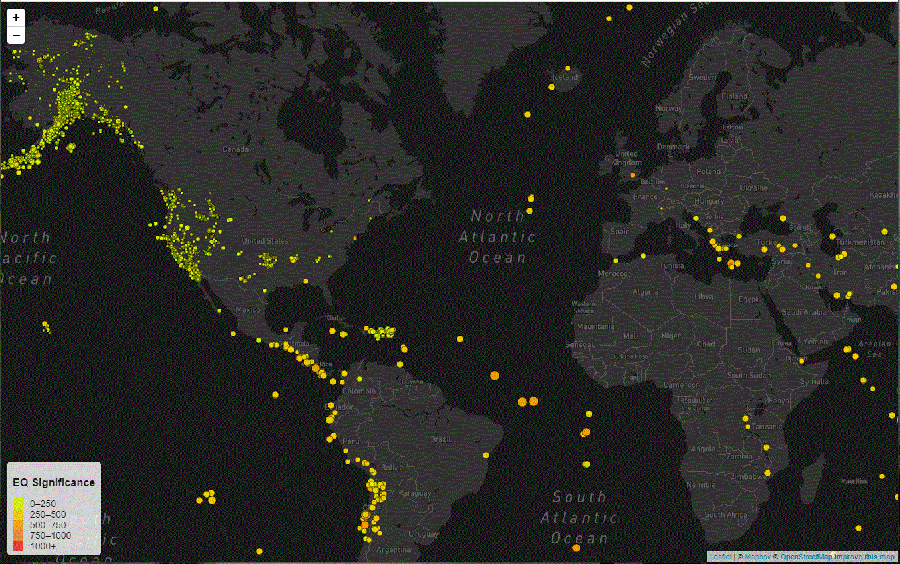

# Visualizing Data with Leaflet

## Background

 The USGS is responsible for providing scientific data about natural hazards, the health of our ecosystems and environment; and the impacts of climate and land-use change. Their scientists develop new methods and tools to supply timely, relevant, and useful information about the Earth and its processes. As a new hire, you will be helping them out with an exciting new project!

The USGS is interested in building a new set of tools that will allow them visualize their earthquake data. They collect a massive amount of data from all over the world each day, but they lack a meaningful way of displaying it. Their hope is that being able to visualize their data will allow them to better educate the public and other government organizations (and hopefully secure more funding..) on issues facing our planet.

1. **Get the Earthquake data set**

   

   The USGS provides earthquake data in a number of different formats, updated every 5 minutes. 
   I used the following dataset to plot earthquakes on your map,
   [Past 30 Days M1.0+ Earthquakes](https://earthquake.usgs.gov/earthquakes/feed/v1.0/summary/1.0_month.geojson)

   visit the [USGS GeoJSON Feed](http://earthquake.usgs.gov/earthquakes/feed/v1.0/geojson.php) page and study the important fields in the geoJSON under the `Output` section,
   (the fields `mag`, `sig` and `time` under the keys features -> properties) 

   

2. **Import & Visualize the Data**

   I created a map using Leaflet that plots all of the earthquakes from the data set based on their longitude and latitude.

   

   * The data markers reflect the magnitude of the earthquake in their size and and the significance of earthquake in their color. Earthquakes with higher magnitudes should appear larger and those with higher significance should appear darker in color.

   * I provided additional information about the earthquake when a marker is clicked.

   

   * Create a legend that will provide context for your map data as shown in the map above. 
   [ther color (Significance) legend displayed on the map]

- - -